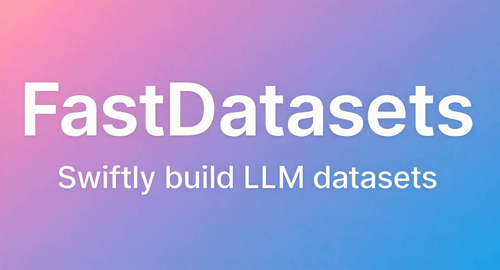

# FastDatasets



A powerful tool for creating high-quality training datasets for Large Language Models (LLMs) | [切换到中文](README.md)

## Main Features

### 1. Document-Based Dataset Generation
- **Intelligent Document Processing**: Supports intelligent segmentation of various document formats
- **Question Generation**: Automatically generates relevant questions based on document content
- **Answer Generation**: Uses LLM to generate high-quality answers
- **Asynchronous Processing**: Supports asynchronous processing of large-scale documents
- **Multiple Export Formats**: Supports multiple dataset format exports (Alpaca, ShareGPT)
- **Direct SFT-Ready Output**: Generates datasets suitable for supervised fine-tuning

### 2. Data Distillation and Optimization
- **Dataset Distillation**: Extracts and optimizes training data from existing datasets
- **Instruction Augmentation**: Automatically generates instruction variants to expand training data
- **Quality Optimization**: Uses LLM to optimize and improve data quality
- **Multi-format Support**: Supports distillation from datasets in various formats

## Quick Start

### Requirements

- Python 3.8+
- Dependencies: See `requirements.txt`

### Installation

```bash
# Clone repository
git clone https://github.com/ZhuLinsen/FastDatasets.git
cd FastDatasets

# Create and activate virtual environment (optional)
conda create -n fast_datasets python=3.10
conda activate fast_datasets

# Install dependencies
pip install -r requirements.txt

# Create environment configuration file
cp .env.example .env
# Edit the .env file to configure your LLM API and other settings
```

### Usage Examples

1. First, configure your LLM
```bash
# Create and edit .env file by copying from .env.example
cp .env.example .env
# Edit .env file and configure your LLM API
# LLM_API_KEY=your_api_key_here
# LLM_API_BASE=https://api.deepseek.com/v1 (or other model API URL)

# Test LLM connection and capabilities
python scripts/test_llm.py
```

2. Generate dataset from documents
```bash
# Generate dataset using test document
python scripts/dataset_generator.py tests/1706.03762v7.pdf -o ./output

# Process custom document
python scripts/dataset_generator.py path/to/your/document.pdf -o ./output_directory

# Process all documents in a directory
python scripts/dataset_generator.py path/to/document/directory/ -o ./output_directory
```

3. Create training datasets using knowledge distillation
```bash
# Extract questions from Huggingface dataset and generate high-quality answers
python scripts/distill_dataset.py --mode distill --dataset_name open-r1/s1K-1.1 --sample_size 10

# Generate variants from high-quality samples and distill knowledge (optional)
python scripts/distill_dataset.py --mode augment --high_quality_file data/high_quality_samples.json --num_aug 3
```

For more detailed usage, please refer to: [Knowledge Distillation Guide](docs/knowledge_distillation.md) | [Document Processing and Dataset Generation](docs/custom_data_conversion.md)

### Supported Document Formats

- PDF (*.pdf)
- Word (*.docx)
- Markdown (*.md)
- Plain text (*.txt)
- Other mainstream document formats

## Output Structure

### Document Processing Output
After processing, the following files are generated in the output directory:

- `chunks.json`: Text chunks after document segmentation
- `questions.json`: Generated questions
- `answers.json`: Generated answers
- `optimized.json`: Optimized QA pairs
- `dataset-alpaca.json`: Dataset in Alpaca format
- `dataset-sharegpt.json`: Dataset in ShareGPT format (if configured)

### Data Distillation Output
The data distillation process creates a timestamp subdirectory in the output directory and generates the following files:

- `distilled.json`: Original data after distillation
- `distilled-alpaca.json`: Distilled data in Alpaca format
- `distilled-sharegpt.json`: Distilled data in ShareGPT format

## Advanced Usage

### API Service

Start the API service, providing a Web interface and RESTful API:

```bash
python -m app.main
```

Default address: http://localhost:8000

### Troubleshooting

1. **Slow processing**: Increase MAX_LLM_CONCURRENCY or reduce LLM_MAX_TOKENS
2. **Out of memory**: Reduce the number or size of documents being processed
3. **API timeout**: Check network connection or reduce MAX_LLM_CONCURRENCY

## License
[Apache 2.0](LICENSE)

## Star History

[](https://www.star-history.com/#ZhuLinsen/FastDatasets&Date) 